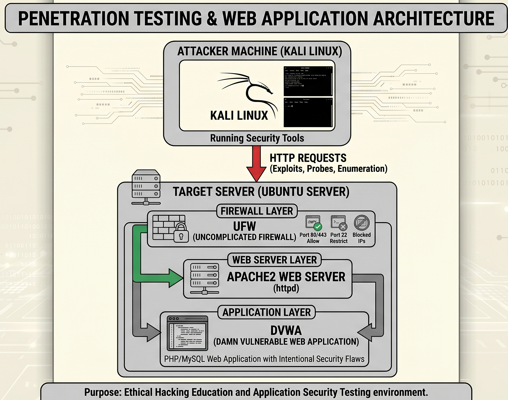

# 🔐 DVWA Firewall Security Lab

[](https://opensource.org/licenses/MIT)


## 📋 Overview

This project demonstrates how a vulnerable web application can be exploited through **SQL Injection** and how network-layer security controls can be used to reduce exposure. It showcases the critical difference between **application-layer vulnerabilities** and **network-layer defenses**.

A comprehensive security lab was built using **Kali Linux**, **Ubuntu Server**, **DVWA**, **Apache2**, and **UFW Firewall** in an isolated, controlled environment for educational purposes.

---

## 🎯 Objectives

The objectives of this project are:

- ✅ Understand how SQL Injection vulnerabilities work
- ✅ Explore the impact of insecure user input handling
- ✅ Configure and test firewall rules using UFW
- ✅ Verify security controls using Nmap and Curl
- ✅ Learn the difference between application and network security
- ✅ Practice building and documenting a cybersecurity lab
- ✅ Demonstrate Defense in Depth security principles

---

## 🏗️ Lab Architecture

### System Environment

| Component | Technology |
|-----------|-----------|
| **Attacker Machine** | Kali Linux |
| **Target Server** | Ubuntu Server |
| **Vulnerable Application** | DVWA (Damn Vulnerable Web Application) |
| **Web Server** | Apache2 |
| **Firewall** | UFW (Uncomplicated Firewall) |
| **Scanning Tool** | Nmap |
| **HTTP Testing Tool** | Curl |
| **Virtualization** | VirtualBox |

### Architecture Diagram



---

## 🔍 Security Analysis

### Vulnerability vs Exposure

**Key Concept:** The SQL Injection vulnerability still exists inside DVWA, but the firewall does not remove it. Instead, it reduces the **attack surface** by limiting who can access the vulnerable service.

This highlights the concept of **Defense in Depth**, where multiple security controls are used together to reduce overall risk:

```
┌─────────────────────────────────────────────┐
│   Defense in Depth Strategy                 │
├─────────────────────────────────────────────┤
│ 1. Network Layer (UFW Firewall)            │
│    ↓ Controls access to ports               │
│ 2. Application Layer (Input Validation)    │
│    ↓ Validates/sanitizes user input        │
│ 3. Database Layer (Least Privilege)        │
│    ↓ Restricts database permissions        │
│ 4. Monitoring & Logging                    │
│    ↓ Detects suspicious activity           │
└─────────────────────────────────────────────┘
```

### Attack Demonstration: SQL Injection

**Vulnerability:** The application fails to properly validate user input, treating malicious input as part of the SQL query rather than data.

**Example Payload:**
```sql
' OR '1'='1
```

**Impact:**
- 🔓 Unauthorized data access
- 📋 Information disclosure
- 🔑 Potential authentication bypass
- 💾 Database compromise

---

## 🧪 Network Testing Results

### Curl Testing

#### Before Firewall Rules

```bash
curl http://TARGET_IP
```

**Result:** ✅ HTML page returned successfully (Web application was reachable)

#### After Firewall Rules

```bash
curl --max-time 5 http://TARGET_IP
```

**Result:** ❌ Connection timed out (HTTP traffic was blocked)

---

### Nmap Scanning

#### Before Firewall Rules

```bash
nmap TARGET_IP
```

**Result:**
```
80/tcp   open
443/tcp  open
```

The service was externally reachable.

#### After Firewall Rules

```bash
nmap TARGET_IP
```

**Result:**
```
80/tcp   filtered
443/tcp  filtered
```

The firewall successfully restricted access.

---

## 📚 Key Learnings

Through this lab, I learned:

1. **How SQL Injection vulnerabilities occur** – Understanding malicious input handling
2. **How attackers interact with vulnerable web applications** – Practical exploitation techniques
3. **How firewalls control network access** – UFW configuration and rule management
4. **How Nmap can be used to verify exposed services** – Network reconnaissance
5. **How Curl can be used to test connectivity** – Application-layer testing
6. **The difference between application security and network security** – Complementary controls
7. **The importance of layered security controls** – Defense in Depth strategy
8. **Real-world security validation techniques** – Before/after testing methodology

---

## 🛠️ Commands Reference

For a detailed breakdown of all commands used in this lab, see [**commands-used.md**](./commands-used.md).

### Quick Reference

**Firewall Configuration:**
```bash
sudo ufw status
sudo ufw deny 80
sudo ufw deny 443
```

**Network Testing:**
```bash
curl http://TARGET_IP
nmap TARGET_IP
```

---

## 🚀 Future Improvements

Planned enhancements include:

- [ ] Deploy **SafeLine WAF** using Docker
- [ ] Compare firewall protection vs WAF protection
- [ ] Implement HTTPS using SSL certificates
- [ ] Add centralized logging and monitoring
- [ ] Automate security checks using Python scripts
- [ ] Create Docker-based deployment for easier lab setup
- [ ] Add intrusion detection system (IDS) monitoring
- [ ] Implement Web Application Firewall (WAF) rules

---

## 🎬 Project Demonstration

### Live Demo

A comprehensive demonstration showing:

- 🔴 SQL Injection attack against DVWA
- 📊 Database information disclosure
- 🔒 UFW firewall configuration
- 📡 Network verification using Curl and Nmap

**Watch the full demo:** [LinkedIn Demo Video](https://www.linkedin.com/posts/bhavesh-salaskar-1b0450355_cybersecurity-ethicalhacking-networksecurity-ugcPost-7457279062781149185-_T0U/?utm_source=share&utm_medium=member_desktop&rcm=ACoAAFiFVhQBjlR2pFZUSk5FsKlJqcGfy-pRwhQ)

---

## ⚠️ Disclaimer

**IMPORTANT:** This project was built and tested in a **controlled local laboratory environment** for educational purposes only.

- ✋ No systems outside the lab environment were targeted or tested
- 🔐 This lab demonstrates security concepts in a safe, isolated setting
- 📖 Intended for learning and professional development
- 🚫 Unauthorized access to computer systems is illegal

---

## 📄 License

This project is licensed under the MIT License - see the [LICENSE](LICENSE) file for details.

---

## 👨‍💻 Author

**Bhavesh Salaskar**

- 🔗 [LinkedIn](https://www.linkedin.com/in/bhavesh-salaskar-1b0450355)
- 📧 bhavsalamvlu@gmail.com

---

## 📞 Support & Feedback

If you have questions or suggestions about this lab:

1. Check the [commands-used.md](./commands-used.md) file for detailed command references
2. Review the architecture diagram for system setup
3. Feel free to open an issue or reach out directly

---

## 🔗 Related Resources

- [DVWA Official Documentation](http://www.dvwa.co.uk/)
- [UFW Firewall Guide](https://help.ubuntu.com/community/UFW)
- [OWASP SQL Injection](https://owasp.org/www-community/attacks/SQL_Injection)
- [Nmap Documentation](https://nmap.org/book/)

---

**Last Updated:** June 2026 | **Status:** 🟢 Active Development
